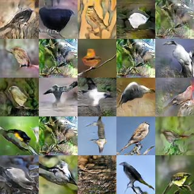
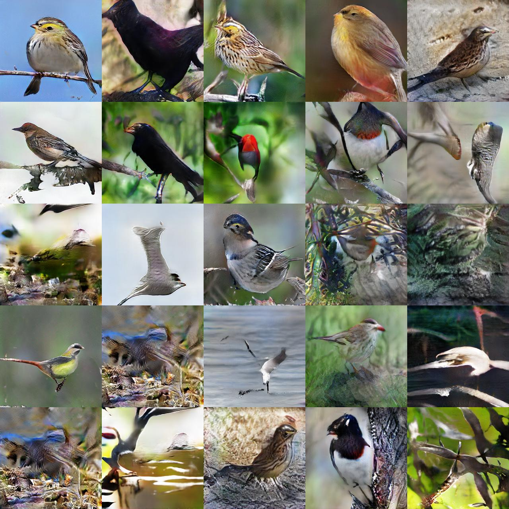

# Chainer-StackGAN
Chainer implementation of StackGAN on CUB
>"StackGAN: Text to Photo-realistic Image Synthesis with Stacked Generative Adversarial Networks," Han Zhang, Tao Xu, Hongsheng Li, Shaoting Zhang, Xiaolei Huang, Xiaogang Wang, Dimitris Metaxas, arXiv:1612.03242.
https://arxiv.org/abs/1612.03242
>Original code: https://github.com/hanzhanggit/StackGAN

# Requirements
- Python 2.7.6+
  - [Chainer 1.22.0+](https://github.com/pfnet/chainer)
  - numpy 1.12.1+
  - scipy 0.13.3+

# Test
## Quick Demo 
1. Download text features from https://drive.google.com/open?id=0B3y_msrWZaXLT1BZdVdycDY5TEE and save it to `data/`
2. Download pretrained weights from https://drive.google.com/drive/folders/0B6nc1VY-iOPZU0w2OVZBMGx3cTQ?usp=sharing and save them to `models/` 
3. `cd stage2`
4. ```python
python demo.py -g=0
```

## Pretrained Weights
Download pretrained weights from my google drive
https://drive.google.com/drive/folders/0B6nc1VY-iOPZU0w2OVZBMGx3cTQ?usp=sharing
Put them on `models/`

# Example result on CUB
- stage1  

- stage2  


# todo
- multi gpu

# Dataset
See original code of [StackGAN](https://github.com/hanzhanggit/StackGAN) to prepare CUB dataset
```python
python StackGAN/misc/preprocess_birds.py
```

# Train
```python
cd stage1
python train_stackgan.py -g=0 
cd stage2
python train_stackgan.py -g=0 -s1w=path/to/stage1/gen_epoch_600.npz
```
